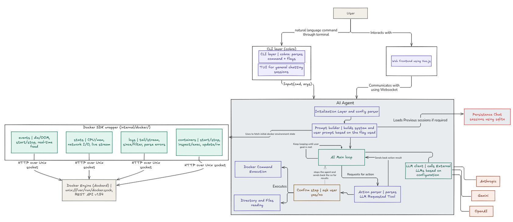

# Docker AI Agent CLI

A Go-based AI agent that helps you inspect and operate local Docker environments through a CLI (and planned TUI/web frontends). It combines a Docker SDK wrapper with LLM-driven planning to propose the next action, then executes tooling in a controlled loop.

## Status

This project is in active development. Core scaffolding is in place (Docker SDK wrapper, prompt templates, Genkit client, Cobra CLI), while tool execution, confirmation flow, persistence, and richer commands are still in progress.

## Architecture



At a high level:

- CLI (Cobra) parses commands/flags and passes the user goal to the agent runtime.
- The AI agent builds prompts from the current Docker context and user intent.
- A main loop selects the next action, maps it to a tool call, and stores results in memory.
- The Docker SDK wrapper provides structured access to containers, images, volumes, and networks.
- LLM providers are pluggable via Genkit (Gemini, OpenAI, Anthropic).

## Features

- Docker environment snapshotting via the SDK wrapper (`internal/docker`).
- Prompt templates for system + user execution context (`internal/core/prompts.go`).
- Genkit-backed LLM client for multiple providers (`internal/core/genkit_client.go`).
- CLI commands for agent chat and planned docker workflows (`cmd/*`).

## Prerequisites

- Go 1.25.0
- Docker Engine available locally for Docker SDK calls.
- One of the supported LLM provider API keys.

## Configuration

Set the provider API key for the model you use. Example for Gemini:

```bash
export GEMINI_KEY=your_key_here
```

## Quick start

Run the agent chat command:

```bash
go run . agent-chat "How do I view running containers?"
```

## CLI commands (current)

- `agent-chat` (`ac`): Ask Docker-related questions via LLM (Gemini example wired).
- `containerize` (`c`): Planned – generate a Dockerfile for the current directory.
- `diagnose` (`d`): Planned – analyze container logs for failures.
- `optimize` (`o`): Planned – suggest improvements for Dockerfiles.

## Project layout

```
cmd/                 Cobra CLI commands
internal/core/       Agent loop, prompts, Genkit client
internal/docker/     Docker SDK wrapper + exec helpers
internal/models/     Shared data models
internal/tools/      Tool registry (planned)
```

## Contributing

Issues and PRs are welcome. Please open an issue to discuss larger changes before submitting a PR.

## License

Licensed under the Apache License, Version 2.0. See [LICENSE](./LICENSE).
